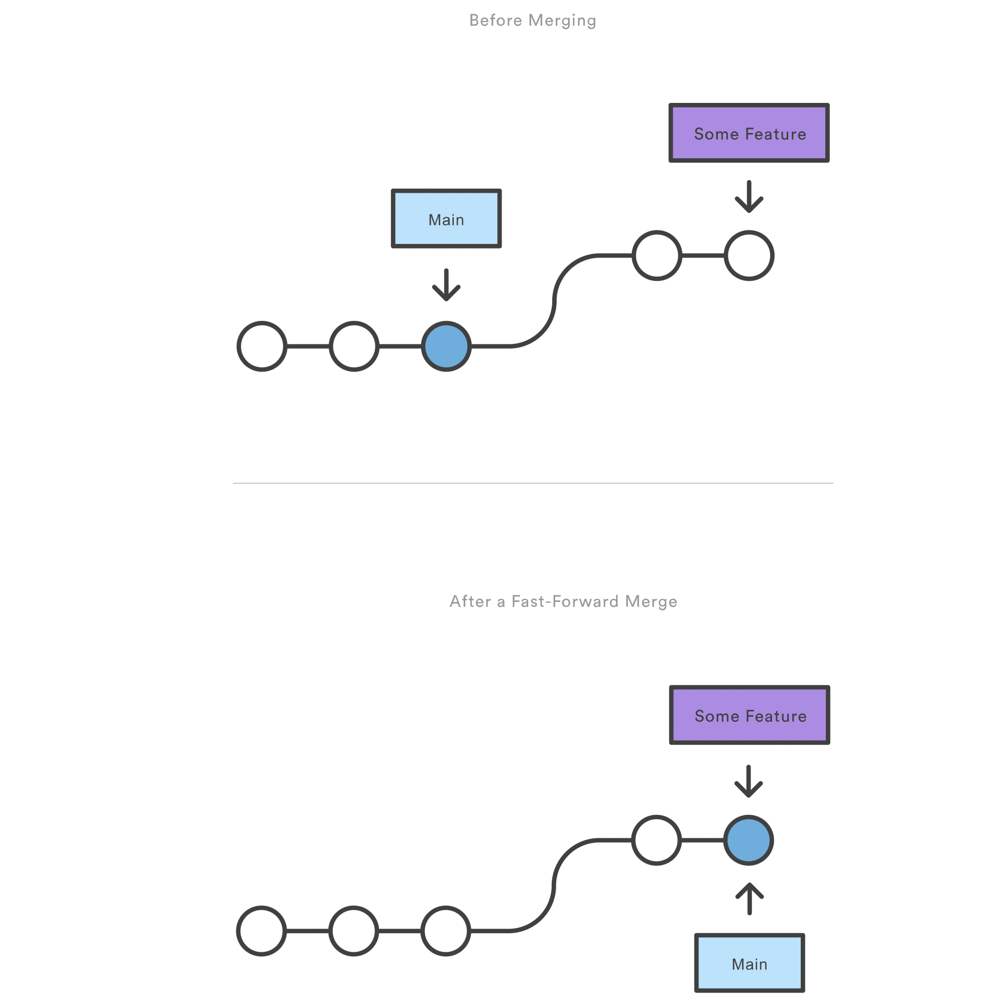

  

<h1 align="center">Git Document 📑</h1>

<h4 align="center">You’re about to spend several hours of your life reading about Git. Let’s take a minute to explain some of features that we learn 😍 </h4>

---

## *STAGE & SNAPSHOT*

- `git init `:

           initialize an existing directory as a Git repository 

- `git clone [url]`:

           retrieve an entire repository from a hosted location
            via URL 

- `git status `:

           show modified files in working directory, staged for 
           your next commit 

- `git add <file..> OR . `:

           The git add command adds a change in the working
            directory to the staging area

- `git diff `:

           That command compares what is in your working directory
            with what is in your staging area

- `git commit -m “[descriptive message]”`:

           commit your staged content as a new commit snapshot

---

## *BRANCH & MERGE*

- `git branch` :

           List all of the branches in your repository

- `git branch <branch>` :

           Create a new branch called ＜branch>

- `git branch -d <branch>` :

           Delete the specified branch

- `git checkout -b ＜new-branch＞` :

          Create the new branch and immediately switch to it
- `git merge [branch]` :

           merge the specified branch’s history into 
           the current one
                    
  in fast-forward Merge can occur when there is a linear path  from the current branch tip to the target branch to imagine the process let's see it with a diagram:

  

  

- `git log `:

           Show the commit history for the currently active branch. 

- `git merge --no-ff <branch>`:

           This command merges the specified branch into the current branch.

- `git push --set-upstream origin <branch name>`:

             To let others see the new main branch, you need to push it to the remote.
   This makes the renamed branch available on the remote

---
## *INSPECT & COMPARE*

- `git log branchB..branchA` :

          Show the commits on branchA that are not on branchB.

- `git log --oneline --graph` :

          Display an ASCII graph of the branch and merge 
          history beside the log output 

- `git diff branchB...branchA` :

          Show the diff of what is in branchA that is not in
           branchB. 
- `git show` :

          Shows one or more objects (blobs, trees, tags and 
          commits). 

- `git remote add origin [url]` : 
          
          Specifies the remote repository for your local
           repository. 
          The url points to a repository on GitHub.

  --- 

  ## *TAGGING*

    Like most VCSs, Git has the ability to tag specific points in a repository’s history as being important. Typically, people use this functionality to mark release points (v1.0, v2.0 and so on). In this section, you’ll learn how to list existing tags, how to create and delete tags: 

- `git tag` :

          This command lists the tags in alphabetical order; the order in which they are displayed has no real importance.

- `git tag -a <tagname>` :

          Create a new Tag called ＜tagname>

- `git tag -a <tagname> -m "msg text"` :

          The -m specifies a tagging message, which is stored with the tag.
          If you don’t specify a message for an annotated tag, Git launches your editor so you can type it in.     

- `git tag -d <tagname>` :

          To delete a tag on your local repository
                      